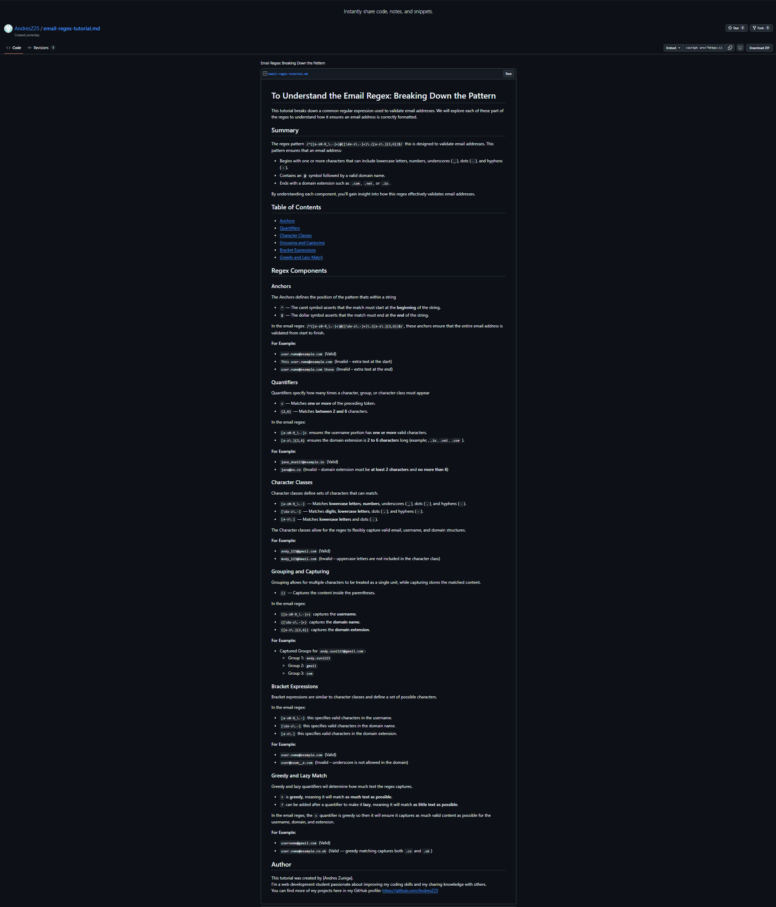

## Understanding the Email Regex (Module 17)

# Description

Welcome to the Email Regex Tutorial! This tutorial breaks down a common regular expression used to validate email addresses.
We'll explore each part of the regex to understand how it ensures an email address is correctly formatted.

The goal of this tutorial is to help you confidently read, understand, and apply this regex pattern in real-world development scenarios.

# Acceptance Criteria

GIVEN a regex tutorial

WHEN I open the tutorial

THEN I see a descriptive title and introductory paragraph explaining the purpose of the tutorial, a summary describing the regex featured in the tutorial, a table of contents linking to different sections that break down each component of the regex and explain what it does, and a section about the author with a link to the author’s GitHub profile

WHEN I click on the links in the table of contents

THEN I am taken to the corresponding sections of the tutorial

WHEN I read through each section of the tutorial

THEN I find a detailed explanation of what a specific component of the regex does

WHEN I reach the end of the tutorial

THEN I find a section about the author and a link to the author’s GitHub profile

# Todo first 

Research the regex pattern /^([a-z0-9_\.-]+)@([\da-z\.-]+)\.([a-z\.]{2,6})$/

Write a descriptive introduction explaining its purpose

Break down each regex component using examples to clarify how it works

Add a helpful Author section with a link to your GitHub profile

Proofread your content to ensure accuracy and clarity

Publish your tutorial following the instructions above

Check all Table of Contents links and ensure content flows correctly

# Installation

1. Create a GitHub Gist.
2. Name the file email-regex-tutorial.md.
3. Copy the content from your Markdown file into the Gist.
4. Set the Gist to Public for accessibility.
5. Click Create public gist to publish it.
6. Verify the formatting, Table of Contents links, and content flow.
7. Proofread your content to ensure accuracy and clarity.
8. Copy the link to your Gist for submission.
9. Ensure your content follows the provided acceptance criteria.
10. Review the tutorial for clarity, ensuring examples are easy to understand.
11. Test all Table of Contents links to confirm they navigate correctly.
12. Submit the Gist link for grading.

here is the link to the GitHub Gist:  https://gist.github.com/AndresZ25/3b2560dc7c9f2731cda53750dcc66d7d 

